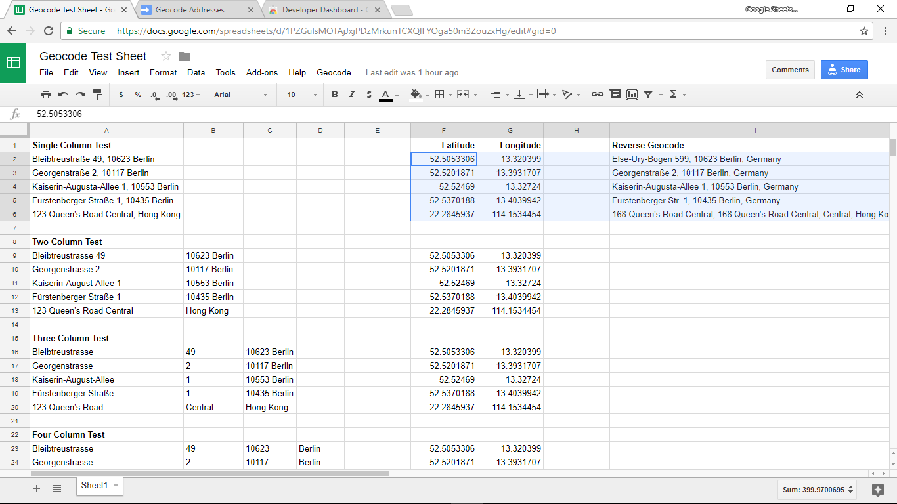

# Google Sheets Geocoding Macro

Geocode from addresses to latitude / longitude, and vice versa using Google Sheets.

## Test Sheet

Try the macro out on a [Test Sheet](https://docs.google.com/spreadsheets/d/1PZGulsMOTAjJxjPDzMrkunTCXQlFYOga50m3ZouzxHg/edit?usp=sharing) with sample address data.

## Google Sheets Add-On

Unfortunately, you've got to add this script to each sheet you are using.

## Multicolumn Addresses &rarr; Latitude, Longitude

Now it supports geocoding using address data spread across multiple columns. 

The way this works is: You select a set of columns containing the data, and the geocoding process puts the latitude, longitude data in the rightmost two columns. It will overwrite any data in those two columns.

Some care is needed, as it will concatenate all columns except the rightmost two columns to create the address string.

## Latitude, Longitude &rarr; Nearest Address

It also supports reverse geocoding. 

Simply select the latitude, longitude columns and it will place the nearest address data in the rightmost column. It will overwrite any data in that column.

Less care is needed, as it will automatically use the leftmost two columns as the latitude, longitude pair.

