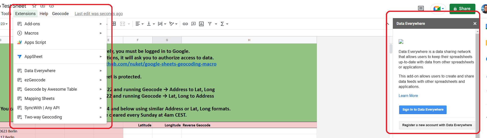
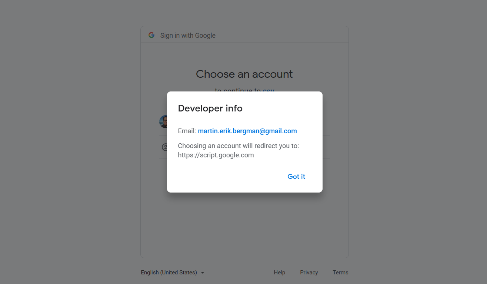
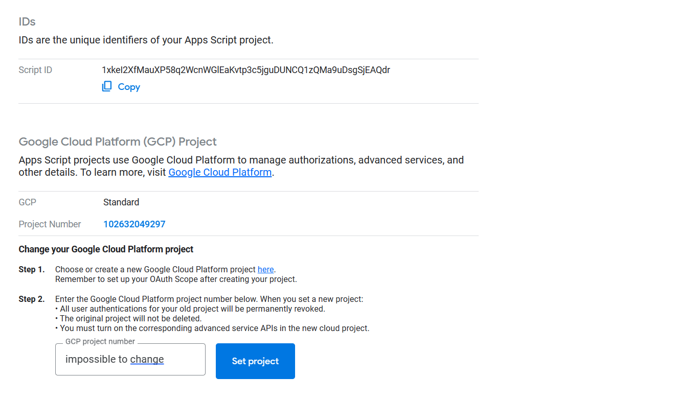
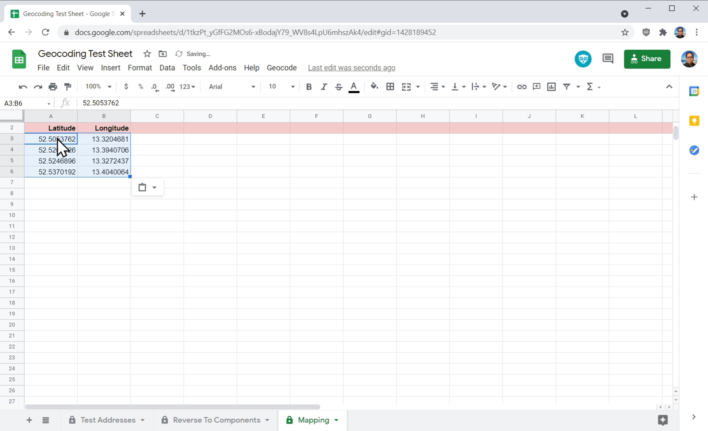

# Google Sheets Geocoding Macro

Geocode from addresses to latitude / longitude, and vice versa using Google
Sheets.

## ~~Test Sheet~~

> ~~Try the script out on a [Test
Sheet](https://docs.google.com/spreadsheets/d/1tkzPt_yGfFG2MOs6-xBodajY79_WV8s4LpU6mhszAk4/edit?usp=sharing)
with sample address data. You can enter your own address data and geocode it  in
the rows below.~~
>
> ~~You **must** be logged into a Google Account before the Geocode menu will
appear.~~
>
> ~~Any data you enter will be automatically deleted every Sunday at 4AM CEST, this
isn't for long term storage.~~

## Nope.

Test Sheet is removed due to:

* Google not locking down Apps Script **editing** capabilities for **Viewers** on the Sheet.
  Because you can lock *cells*, but you can't lock *code*! Minor oversight!
* too many people then editing the Apps Script code
* too many people then breaking the Apps Script code and not fixing it afterwards
* people immediately breaking the Cleanup code so that their data stays forever
  (let's boil the oceans together!)
* people adding random Extensions to this shared Sheet
* Google not providing a way *at all* to remove Extensions that Viewers have added
  
* people associating the Sheet with their own Google Cloud Platform projects
  and breaking it for me and everyone else
  
* Google not providing any sensible or quick ways to disassociate other peoples' GCP Project IDs
  (no I do not want to screw around in the Google Cloud Console all afternoon)
  
* me getting notifications from Google every time people now want access to the sheet
  I created publicly, when access was not an issue before (to be fair, this probably
  changed as Google changed things in their backend to compel authentication to a
  once-public API)
* ... other idiotic shenanigans

**Good luck, this was a great experiment in the tragedy of the commons.**

A few days ago, someone dropped a yogurt in the entrance hall to my apartment building
and didn't clean it up. It was still there > 24 hours later, curdling into sour cream. Cool.

## Multicolumn Addresses &rarr; Latitude, Longitude

Now it supports geocoding using address data spread across multiple columns.

The way this works is: You select a set of columns containing the data, and the
geocoding process puts the latitude, longitude data in the **rightmost two
columns**. It will overwrite any data in those two columns.

Some care is needed, as it will concatenate all columns except the rightmost two
columns to create the address string.

## Latitude, Longitude &rarr; Nearest Address

It also supports reverse geocoding.

Simply select the latitude, longitude columns and it will place the nearest
address data in the rightmost column. It will overwrite any data in that column.

Less care is needed, as it will automatically use the **leftmost two columns** as
the latitude, longitude pair.

## Latitude, Longitude &rarr; Address Components

It now supports reverse geocoding and splitting the address components into
different columns.

See the Reverse To Components tab in the [Test
Sheet](https://docs.google.com/spreadsheets/d/1tkzPt_yGfFG2MOs6-xBodajY79_WV8s4LpU6mhszAk4/edit?usp=sharing).

## Map Cells

It now supports mapping the Latitude, Longitude pairs in the Mapping tab.

## Adding It To Your Own Sheet

Step 1. Create or Open a Google Sheet and add addresses to it.

Step 2. Tools -> Script Editor

Step 3. Copy [this script
code](https://raw.githubusercontent.com/nuket/google-sheets-geocoding-macro/master/Code.gs)
into the Code.gs editor, replacing everything.

Step 4. Save

Step 5. Reload Sheet

Step 6. Run Geocode, Click Through Warnings

That's it.

## Troubleshooting

* I don't see the Geocode menu!

  You **must** be logged into a Google Account before the Geocode menu will
  appear. Anonymous / not logged-in users will not work, Incognito Mode will not
  work.

* It gives me a bunch of warnings when I run it the first time.

  If you're using the Test Sheet, this means that the script will have access to
  the data you are entering. Don't enter anything you wouldn't want me to see,
  because as the owner of the shared Sheet, I see the data that gets put into
  it.

  If you've added the script to your own sheet, this means that the script will
  have access to the data you are entering. Since you're the owner of your
  Sheet, this isn't an issue. You can always audit the script by reading the
  source code in this repository.

* It returns latitude / longitude data using "," instead of "." separators.

  There's not much I can do about the return formats, but a user reported that
  adding the following array formula to the latitude / longitude columns changes
  the separators for them: `=ARRAYFORMULA(SUBSTITUTE(C2:C;",";"."))`.

  Make sure you specify the correct columns.
